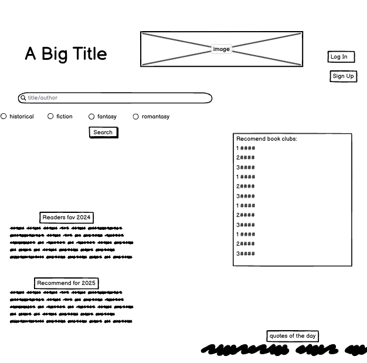

# Project Title

The Bookmark

## Overview

This web application allows users to serach for books, view book details, and join book clubs to discuss their favorite books with like-minded readers. Unlike traditional book clubs where users must read pre-selected books, this platfrom enables users to join clubs based on the books they are already reading.

### Problem Space

Book lovers often struggle to find communities discussing the books they are currently reading. Many book clubs follow predefined reading lists, which may not always align with indivudual interests. This website s a solution by allowing users to join discussions based on books they choose to read.

### User Profile

The app is designed for:

-Readers who want to connect with others reading the same book.

-Individuals who prefer discussing specific books rather than following a preset club schedule.

-Users looking for book recommendations and engaging discussions.

### Features

-User Authentication: Users can sign up and log in to access personalized features.

-Book Search: Users can search for books by title or author.

-Book Details Page: Displays book information including description, ratings, and reviews.

-Book Club Membership: Users can join a book club for a specific book.

-Discussion Board: Users can leave comments, share insights, and discuss books in their respective clubs.

-Genre Filtering: Users can filter books by historical, fiction, and fantasy genres.

-Quote of the Day: Displays a daily quote from famous writers.

-Best Books of 2024 & Recommendations for 2025: A manually curated list of top books.

## Implementation

### Tech Stack

Frontend:

-React.js

-React Router (for navigation)

-Sass (for styling)

-Axios (for API requests)

Backend:

-Node.js with Express.js

-MySQL

### APIs

APIs:

-Google Books API (for book search & details)

-Quotes API (for daily quotes)

-Manually created JSON file (for best books of 2024 & recommendations for 2025)

### Sitemap

**Home Page**

-Banner image with app title

-Search box for books

-Genre filtering (radio buttons)

-Table with "Best Books of 2024" & "Recommended for 2025"

-Recommended Book Clubs section

-Quote of the Day section

**Book Details Page**

-Book title, author, description, and rating

-"Join Book Club" button

-Comments and discussion board

**Book Club Page**

-List of users in the club

-Discussion board (users can post and comment)

**Authentication Pages**

-Sign Up / Log In

### Mockups



### Data

Users Table : id, name, email, password

Book Table: id, title, author, genre, description, rating

Book Clubs Table: id, book_id, club_name

Comments Table: id, user_id, club_id, comment, timestamp

### Endpoints

User Signup - Endpoint: POST /auth/signup

User Login - Endpoint: POST /auth/login

Search Books - Endpoint: GET /books?query=title
Example:

```json
[
{
"id": 1,
"title": "Housemates: A Novel",
"author": "Emma Copley Eisenberg",
"genre": "Fiction",
"description": "Two young housemates embark on a road trip ...",
"rating": 3.6
}
]

Join Book Club - Endpoint: POST /clubs/join

Post a Comment in Book Club - Endpoint: POST /clubs/:id/comments

## Roadmap

Phase 1 (Day 1 - 4)

Set up React frontend with routing

Implement user authentication (Sign In / Sign Up)

Integrate Google Books API for search functionality

Phase 2 (Day 4 - 8)

Develop backend with Express and MySQL

Implement book details and club discussion pages

Allow users to join clubs and leave comments

Phase 3 (Day 8 - 11)

Implement quote of the day feature

Add best books of 2024 and recommendations for 2025

Refine UI/UX and deploy application

## Future Implementations

Private Book Clubs: Allow users to create private clubs.

Notifications: Notify users about new discussions in their book clubs.

User Profiles: Display user activity and favorite books.
```
